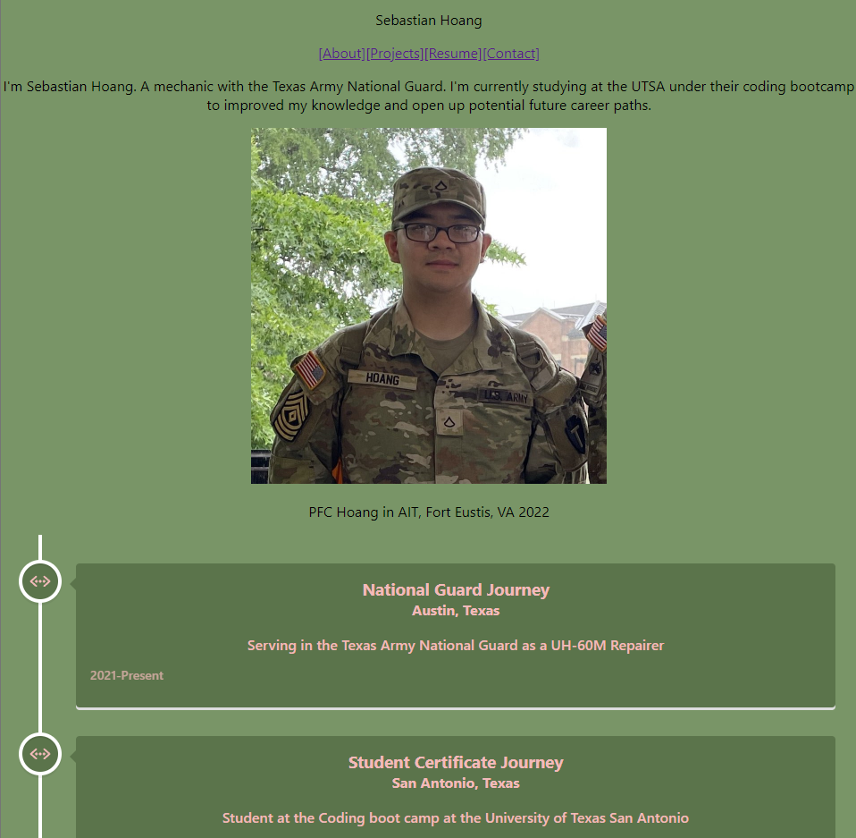

# Getting Started with Create React App

This project was bootstrapped with [Create React App](https://github.com/facebook/create-react-app).

# SHoang_Portoflio
This is a simple portfolio made using react for Sebastian Hoang. It is a simplified portfolio made due to time constraint (see note). The portfolio features an about section with a photo and timeline of events. Following that is a resume that is then followed by a portfolio of work. At the bottom is the link to my github account.

## Note
Monthly military drills with no cell service consumed majority of the time

## Usage

Github Repository:
https://github.com/SHoang6702/SHoang-React-Portfolio

Netifly Deployed Link:
https://prismatic-taffy-407d6c.netlify.app/

## Credits
Sebastian Hoang: https://github.com/SHoang6702

Special thanks to:
### Resources
- https://www.w3schools.com/
- https://stackoverflow.com/
- https://developer.mozilla.org/en-US/
- https://www.youtube.com/

## License
None